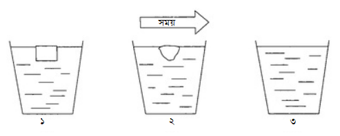
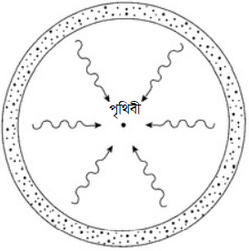

# মুমূর্ষু মহাবিশ্ব {#dying-universe}

১৮৫৬ সালের কথা। জার্মান পদার্থবিদ হেরম্যান ভন হেলমহলজ বিজ্ঞানের ইতিহাসের সম্ভবত সবচেয়ে হতাশাজনক অনুমানটি করেন। হেলমহলজ বললেন, মৃত্যুর দিকে এগিয়ে চলেছে মহাবিশ্ব। তাঁর এ অনুমানের ভিত্তি হলো তথাকথিত তাপ গতিবিদ্যার দ্বিতীয় সূত্র। সূত্রটি প্রথম আত্মপ্রকাশ করে ঊনবিংশ শতকের শুরুর  দিকে। উদ্দেশ্যে ছিল তাপ ইঞ্জিনের কর্মদক্ষতার (efficiency) সংজ্ঞা দেওয়া। অল্প দিনের মাথায়ই সূত্রটির বিশ্বজনীন গুরুত্ব স্বীকৃতি পেয়ে গেল। (অনেক সময় একে সহজ করে দ্য সেকেন্ড ল্য বা দ্বিতীয় সূত্রও বলা হয়)। প্রকৃতপক্ষেে আক্ষরিক অর্থেই এর গুরুত্ব বিশ্বজনীন, তথা সমগ্র মহাবিশ জুড়ে। 

সবচেয়ে সহজ কথায় দ্বিতীয় সূত্রের বক্তব্য হলো, তাপ প্রবাহিত হয় উত্তপ্ত বস্তু থেকে শীতল বস্তুর দিকে। হ্যাঁ, ভৌত পরিবেশের একটি পরিষ্কার ও পরিচিত বৈশিষ্ট্য এটি। খাবার রান্না করতে গেলে বা গরিম কফি ঠাণ্ডা করতে গেলেই সূত্রটির দেখা পাই আমরা। উচ্চ তাপমাত্রার এলাকা থেকে তাপ নিম্ন তাপমাত্রার এলাকার দিকে প্রবাহিত হয়। এতে কোনো রহস্য নেই। পদার্থের অণুর জগতের কম্পনের মাধ্যমে তাপ নিজের বহিঃপ্রকাশ ঘটায়। গ্যাসের মধ্যে (যেমন বায়ু) অণুরা এলোমেলোভাবে ছোটাছুটি ও সংঘর্ষ করে। এমনকি কঠিন পদার্থের মধ্যেও পরমাণুরা প্রবলভাবে স্পন্দিত হয়। পদার্থের উষ্ণতা যত বেশি হবে, অণুর কম্পনের প্রাবল্যও তত বেশি হবে। ভিন্ন তাপমাত্রার দুটো বস্তুকে সংস্পর্শে আনা হলে উত্তপ্ত বস্তুটির অধিকতর প্রবল কম্পন অল্প সময়ের মধ্যেই ঠাণ্ডা বস্তুটিতে ছড়িয়ে পড়বে। 

```{r arrow, echo=FALSE, fig.cap = "Arrow of Time", fig.align = 'center', out.width = '70%'}
knitr:: 
```

চিত্র ২.১: অ্যারো অব টাইম বা সময়ের তীর। বরফের গলন থেকে সময় প্রবাহের দিক সম্পর্কে একটি ধারণা পাওয়া যায়। তাপ গরম পানি থেকে ঠাণ্ডা বরফের দিকে প্রবাহিত হয়। কোনো মুভিতে যদি ওপরের ছবির ঘটনাটি গ, খ, ক আকারে দেখানো হয়, তবে ভুলটি সহজেই সবার চোখে ধরা পড়বে। এনট্রপি নামে একটি রাশি এ অপ্রতিসাম্যের বৈশিষ্ট্য প্রকাশ করে। বরফ গললে এর পরিমাণ বাড়ে। 

তাপের প্রবাহ যেহেতু একমুখী, তাই প্রক্রিয়াটিতে সময়ের ভারসাম্য নেই। কোনো মুভিতে যদি দেখানো হয় ঠাণ্ডা বস্তু থেকে তাপ স্বতঃস্ফূর্তভাবে গরম বস্তুতে যাচ্ছে, সেটা খুবই হাস্যকর হবে। একই রকম হাস্যকর হবে নদীর পানি ঢালু বেয়ে উঠে যাচ্ছে বা বৃষ্টির ফোটা মেঘে গিয়ে জমা হচ্ছে দেখানোটা। ফলে আমরা তাপ প্রবাহের একটি মৌলিক দিকমুখিতা দেখতে পাচ্ছি। একে অনেক সময় অতীত থেকে ভবিষ্যতের দিকে চিহ্নিত একটি তীরের মাধ্যমে দেখানো হয়। সময়ের এই ‘তীর’ তাপগতীয় প্রক্রিয়ার অপ্রত্যাগামী  [^1] আচরণ প্রকাশ করে। দেড়শ বছর ধরে বিষয়টি পদার্থবিজ্ঞানীদের অভিভূত করেছ চলেছে। (দেখুন চিত্র ২.১)

তাপগতিবিদ্যার অপ্রত্যাগামী বৈশিষ্ট্য প্রকাশ করার জন্যে এনট্রপি রাশিটি খুব গুরুত্বপূর্ণ। এ বিষয়টির স্বীকৃতি মেলে হেলমহলজ, রুডলপ ক্লসিয়াস ও লর্ড কেলভিনের কাজের মাধ্যমে। একটি সহজ বিষয় চিন্তা করা যাক। একটি উষ্ণ বস্তু একটি ঠাণ্ডা বস্তুর সংস্পর্শে আছে। এক্ষেত্রে তাপ শক্তি ও তাপমাত্রা অনুপাতকে এনট্রপির সংজ্ঞা হিসেবে চিন্তা করা যায়। মনে করুন, অল্প পরিমাণ তাপ উষ্ণ বস্তুটি থেকে শীতল বস্তুতে প্রবাহিত হচ্ছে। উষ্ণ বস্তুটি কিছু এনট্রপি হারাবে, আর শীতল বস্তুটি কিছু এনট্রপি লাভ করবে। এখানে তাপ শক্তির পরিমাণ একই থাকলেও তাপমাত্রা কিন্তু ভিন্ন ছিল। অত্রএব, উষ্ণ বস্তুটি যতটুকু এনট্রপি হারিয়েছে, শীতল বস্তুটি তার চেয়ে বেশি এনট্রপি লাভ করেছে। ফলে সিস্টেমের মোট এনট্রপি, মানে উষ্ণ ও বস্তু শীতল বস্তুর এনট্রপির সমষ্টি বেড়েছে। তার মানে, তাপগতিবিদ্যার দ্বিতীয় সূত্রকে আরেকভাবেও বলা যায়। এ ধরনের সিস্টেমের এনট্রপি কখনও হ্রাস পাবে না। কারণ, সেক্ষেত্রে কিছু পরিমাণ তাপকে স্বতঃস্ফূর্তভাবে শীতল বস্তু থেকে উষ্ণ বস্তুতে প্রবাহিত হতে হবে। [^2]

আরেকটু গভীরভাবে চিন্তা করলে সূত্রটিকে যে-কোনো বদ্ধ সিস্টেমের জন্যে প্রয়োগ করা যায়: এনট্রপি কখনোই কমে না। ধরা যাক সিস্টেমে আছে একটি রেফ্রিজারেটর (ফ্রিজ)। এটি শীতল বস্তু থেকে উত্তপ্ত বস্তুতে তাপ পাঠায়। এনট্রপির মোট পরিমাণ হিসেব করতে হলে ফ্রিজ চালানোর জন্যে ব্যয় হওয়া শক্তির কথা মাথায় রাখতে হবে। এই ব্যয়ের প্রক্রিয়ার কারণেই কিছু এনট্রপি বেড়ে যাবে। ফলে সবসময় একই ঘটনা ঘটবে। ফ্রিজ ঠাণ্ডা বস্তুকে গরম করে কিছু এনট্রপি কমাবে ঠিকই, কিন্তু ফ্রিজ চালু রাখতে গিয়ে যে পরিমাণ এনট্রপি বাড়বে সেটা এর চেয়ে ঢের বেশি।  প্রাকৃতিক সিস্টেমগুলোতেও একই ঘটনা ঘটে। যেমন, বিভিন্ন জীবের দেহে বা স্ফটিক তৈরির প্রক্রিয়া। সিস্টেমেরে এক অংশের এনট্রপি কমে যায়, কিন্তু অপর কোনো অংশে ঠিকই তার চেয়ে বেশি পরিমাণ এনট্রপি বেড়ে যায়। সব মিলিয়ে চিন্তা করলে এনট্রপি কখনোই কমে না। 

সামগ্রিকভাবে পুরো মহাবিশ্বকে একটি একটি বদ্ধ সিস্টেম ভাবা যায়। এই অর্থে যে, এর ‘বাইরে’ কিছুই নেই। তাহলে, তাপগতিবিদ্যার দ্বিতীয় সূত্র গুরুত্বপূর্ণ একটি পূর্বাভাস প্রদান করে। সেটি হলো, মহাবিশ্বের মোট এনট্রপি কখনোই কমে না। আসলে এটি অপ্রতিরোধ্য গতিতে বেড়েই চলে। আমাদের খুব কাছেই তো এর একটি নমুনা আছে। বলছি সূর্যের কথা। সূর্য অবিরাম মহাশূন্যের শীতল অঞ্চলের দিকে তাপ ছড়িয়ে দিচ্ছে। তাপ ছড়িয়ে পড়ছে মহাবিশ্ব জুড়ে। ফিরে আসছে না কখনও। একটি স্পষ্ট অপ্রত্যাগামী প্রক্রিয়া। 

ভাবনার বিষয় হলো, এটা কি সম্ভব যে মাহবিশ্বের এনট্রপি চিরকাল বাড়তেই থাকবে। মনে করুন, এমন একটি পাত্র নেওয়া হলো, যেখান থেকে কোনো তাপ বের হতে পারে না, আবার কোনো তাপ সেখানে প্রবেশও করতে পারে না। ধরুন সেখানে একটি উষ্ণ ও একটি শীতল বস্তুকে পাশাপাশি রাখা হলো। তাপ শক্তি উষ্ণ বস্তু থেকে শীতল বস্তুতে প্রবাহিত হবে। এনট্রপি বাড়বে। কিন্তু এক পর্যায়ে শীতল বস্তুটি গরম হবে এবং উষ্ণ বস্তুটি ঠাণ্ডা হবে। ফলে দুটোর তাপমাত্রা সমান হয়ে যাবে। এ অবস্থায় পৌঁছার পর আর কোনো তাপ বিনিময় হবে না। পাত্রের ভেতরের সিস্টেম একটি নির্দিষ্ট তাপমাত্রায় পৌঁছবে। সর্বোচ্চ এনট্রপির এই সুস্থিত দশাকে তাপগতীয় সাম্যাবস্থা বলে। সিস্টেমটি বিচ্ছিন্ন থাকলে আর কোনো পরিবর্তন হওয়ার কথা নয়। কিন্তু বস্তুগুলোকে কোনোভাবে প্রভাবিত করলে ভিন্ন কথা। যেমন ধরুন, পাত্রের বাইরে থেকে আরও তাপ সরবরাহ করা হলো। সেক্ষেত্রে তাপীয় ঘটনা আরও ঘটবে। এবং এনট্রপির সর্বোচ্চ সীমা আরেকটু বাড়বে। 

মহাবিশ্বের পরিবর্তন সম্পর্কে তাপগতিবিদ্যার এ সূত্রগুলোর বক্তব্য কী? সূর্য এবং অধিকাংশ নক্ষত্রের কথা যদি বলি, তাপ নির্গমনের প্রক্রিয়া আরও বহু বিলিয়ন বছর ধরে চলতে পারে। কিন্তু এর যে শেষ নেই তা নয়। একটি সাধারণ নক্ষত্রের তাপ উৎপন্ন হয় এর অভ্যন্তরে সংঘটিত নিউক্লিয়ার প্রক্রিয়ার মাধ্যমে। পরে আমরা দেখব, সূর্যের জ্বালানি এক সময় ফুরিয়ে যাবে। এবং সবকিছু ঠিকঠাক থাকলে এক সময় এর তাপমাত্রা এর পাশ্ববর্তী মহাশূন্যের তাপমাত্রার সমান হয়ে যাবে।

হেরম্যান ভন হেলমহলজ অবশ্য নিউক্লিয়ার বিক্রিয়ার কথা জানতেন না। (সূর্য এত বিপুল শক্তি কীভাবে উৎপন্ন করে তা তাঁর সময়ে অজানা ছিল) তবে একটি সার্বিক নীতি তাঁর জানা হয়ে গিয়েছিল। সেটা হলো, মহাবিশ্বের সকল ভৌত প্রক্রিয়া একটি চূড়ান্ত তাপগতীয় সাম্যাবস্থা বা সর্বোচ্চ এনট্রপির দিকে এগোচ্ছে। তার পরে আর কোনো দিন বলার মতো কিছু ঘটার সম্ভাবনা নেই। প্রথম দিকের বিশেষজ্ঞরা সাম্যাবস্থার দিকের এই একমুখী গতিকে নাম দেন ‘তাপীয় মৃত্যু’ (heat death)। তবে সবাই মানতেন যে বাইরে থেকে কাজ করে স্বতন্ত্র সিস্টেমকে আবার সক্রিয় করা যেতে পারে। কিন্তু সংজ্ঞা অনুসারেই মহাবিশ্বের ‘বাইরে’ কিছুই নেই। ফলে, সামগ্রিক সেই তাপীয় মৃত্যু ঠেকানোর মতো কিছুই নেই। অনিবার্য এক পরিণতি। 

তাপগতিবিদ্যার সূত্রের কারণে মহাবিশ্ব অপ্রতিরোধ্যভাবে মৃত্যুর দিকে এগিয়ে যাচ্ছে, এ আবিষ্কার বহু প্রজন্মের বিজ্ঞানী ও দার্শনিককে হতাশ করেছে। যেমন বার্টান্ড রাসেল তাঁর *হোয়াই আই অ্যাম নট অ্যা ক্রিশ্চিয়ান* বইয়ে নিজের বিষণ্ণ মনোভাব তুলে ধরতে গিয়ে বলেন, 

> যুগের পর যুগ ধরে করে যাওয়া এত সব পরিশ্রম, এত ঐকান্তিকতা, এত সব উৎসাহ-উদ্দীপনা, মানুষের বুদ্ধিমত্ত্বার এত দারুণ সব নিদর্শন সৌরজগতের মৃত্যুর সাথে সাথে হারিয়ে যাবে, আর মানুষের সকল অর্জন অনিবার্যভাবে মহাবিশ্বের ধ্বংসাবশেষের নিচে চাপা পড়বে — এ কথাগুলোর সাথে সবাই একমত না হলেও এর বিপক্ষ কোনো দর্শন প্রয়োগ করেও এর থেকে বাঁচার আশা করা যেতে পারে না। শুধু এই সত্যের ওপর ভর করেই, এই কঠিন হতাশার ওপর দৃঢ়ভাবে দাঁড়িয়ে থেকেই আত্মাকে নিরাপদ করা যেতে পারে।

তাপগতিবিদ্যার দ্বিতীয় সূত্র ও এর মরণোন্মুখ মহাবিশ্ব বিষয়ক ফলাফল সম্পর্কে অনেকই মন্তব্য করেছেন, মহাবিশ্ব আসলে নিরর্থক জিনিস। এবং চূড়ান্তভাবে মানুষের অস্তিত্বও অর্থহীন। এই হতাশাব্যঞ্জক মন্তব্য সম্পর্কে আমি পরের অধ্যায়গুলোতে কথা বলব। এই ধারণা ঠিক কি ভুল সেটাও আলোচনা করব। 

মহাবিশ্বের চূড়ান্ত তাপীয় মৃত্যু যে কেবল ভবিষ্যৎ মহাবিশ্বের কথাই বলছে তা কিন্তু নয়। অতীতের ওপরও ভূমিকা আছে এর। এটা পরিষ্কার যে মহাবিশ্ব যদি একটি নির্দিষ্ট হারে নিঃশেষ হয়ে যেতে থাকে, তবে এর পক্ষে চিরকাল টিকে থাকা অসম্ভব। কারণটা খুব সোজা। মহাবিশ্বের বয়স যদি অসীম হত, তবে এত দিনে এর মৃত্যুই হয়ে যেত। যে জিনিস নির্দিষ্ট হারে শেষ হয়ে যেথে থাকে সেটার পক্ষে চিরকাল টিকে থাকা সম্ভব নয়। অন্য কথায়, অবশ্যই একটি নির্দিষ্ট সময় আগে মহাবিশ্বের জন্ম হয়েছে। 

একটা বড় বিষয় হলো, ঊনবিংশ শতকের বিজ্ঞানীরা এই বড় ফলাফলটি ভালোমতো বুঝতে পারেননি। ১৯২০ এর দশকে মহাকাশ পর্যবেক্ষণের মাধ্যমে বোঝা গেল, আকস্মিক এক মহাবিস্ফোরণের (বিগ ব্যাং) মাধ্যমে জন্ম হয়েছে মহাবিশ্বের। তবে দেখা যাচ্ছে, শুধু তাপগতীয় কারণের ওপর ভিত্তি করেই মহাবিশ্বের একটি নির্দিষ্ট সময়ে শুরুর  বিষয়ে আগে থেকেই দৃঢ় সমর্থন ছিল। 

```{r olbers, echo=FALSE, fig.cap = "Olbers’ paradox", fig.align = 'center', out.width = '70%'}
knitr:: 
```

চিত্র ২.২: ওলবার্স প্যারাডক্স:মনে করুন, মহাবিশ্ব অপরিবর্তনশীল। নক্ষত্রগুলো নির্দিষ্ট একটি গড় ঘনত্ব নিয়ে এলোমেলোভাবে ছড়িয়ে ছিটিয়ে আছে। চিত্রে পৃথিবীর চরাদিকের একটি চিকন গোলকীয় খোলসের মধ্যে অবস্থিত নক্ষত্রদের কিছু দেখানো হলো। (খোলসের বাইরের নক্ষত্রগুলোকে চিত্র থেকে বাদ দেওয়া হয়েছে।) এ খোলসের নক্ষত্রগুলো থেকে আসা আলোই পৃথিবীতে পতিত সমস্ত নাক্ষত্রিক আলোর যোগান দেয়। একটি নির্দিষ্ট নক্ষত্র থেকে আসা আলো এর খোলসের ব্যাসার্ধের বর্গ অনুপাতে কমে যায় [^3] । আবার, খোলসের ব্যাসার্ধ বাড়ার সাথে সাথে নক্ষত্রের সংখ্যাও বেড়ে যায় বর্গ অনুপাতেই। ফলে দুটো প্রভাব একে অপরকে বাতিল করে দেয়। তার মানে, খোলসের মোট দীপ্তি [^4] এর ব্যাসার্ধের ওপর নির্ভর করে না। মহাবিশ্ব অসীম হলে এতে এরকম খোলসের সংখ্যাও অসীম হবে। ফলে, পৃথিবীর বুকে এসে পতিত আলোর পরিমাণও অসীম হবার কথা। 

কিন্তু বাস্তবে এমনটা দেখা যায়নি বলে ঊনবিংশ শতকের জ্যোতির্বিদদেরকে মহাবিশ্ব বিষয়ক একটি আগ্রহোদ্দীপক প্যারাডক্স হতবুদ্ধিতে ফেলে দেয়। জার্মান জ্যোতির্বিদ ওলবারের নাম অনুসারে একে ওলবার’স প্যারাডক্স বলে ডাকা হয়। তিনিই প্যারাডক্সটির জন্ম দেন। এটি একটি সরল কিন্তু খুব গুরুত্বপূর্ণ প্রশ্ন উত্থাপন করে। রাতের আকাশ কেন কালো?

প্রথম দৃষ্টিতে একে ছোটখাটো সমস্যা মনে হবে। রাতের আকাশ কালো, কারণ নক্ষত্ররা আমাদের থেকে অনেক অনেক দূরে আছে। তাই এরা অনুজ্জ্বল। (দেখুন চিত্র ২.২) কিন্তু ধরুন, মহাশূন্যের কোনো শেষ নেই। সেক্ষেত্রে নক্ষত্রের সংখ্যা অসীম হতে তো কোনো বাধা নেই। অসীম সংখ্যক অুনজ্জ্বল নক্ষত্রের আলো একত্র করলে তো প্রচুর আলো হয়। মহাশূন্যে প্রায় সুষমভাবে (সমান এলাকায় প্রায় সমান সংখ্যক) বিন্যস্ত অসীম সংখ্যক অপরিবর্তনশীল নক্ষত্রের মোট আলোর পরিমাণ সহজেই হিসেব করে বের করা যায়। বিপরীত বর্গীয় সূত্র অনুসারে দূরত্বের সাথে সাথে উজ্জ্বলতা কমে আসে। এর মানে হলো, দূরত্ব দ্বিগুণ হলে উজ্জ্বলতা চার ভাগের এক ভাগ হয়ে যাবে। দূরত্ব তিন গুণ হলে উজ্জ্বলতা হবে নয় ভাগের এক ভাগ। এভাবেই চলতে থাকবে। অন্য দিকে যত দূর পর্যন্ত দৃষ্টি দেওয়া হবে, নক্ষত্রের সংখ্যা তত বাড়তে থাকবে। এবং সাধারণ জ্যামিতির মাধ্যমেই দেখানো যায়, এক শ আলেকবর্ষ দূরে যত নক্ষত্র আছে, দুই শ আলোকবর্ষ দূরে তার চার গুণ নক্ষত্র আছে। আবার, এক শ আলেকবর্ষ দূরে যত নক্ষত্র আছে, তিন শ আলোকবর্ষ দূরে আছে তার নয় গুণ নক্ষত্র। তার মানে, দূরত্বের বর্গের সমানুপাতে নক্ষত্রের সংখ্যা বেড়ে যাচ্ছে আর উজ্জ্বলতা কমে যাচ্ছে। দুটো প্রভাব একে অপরকে বাতিল করে দিচ্ছে। তার অর্থ হলো, একটি নির্দিষ্ট দূরত্বে অবস্থিত সবগুলো নক্ষত্র থেকে মোট কী পরিমাণ আলো আসবে তা দূরত্বের ওপর নির্ভরশীল নয়। দুই শ আলোকবর্ষ দূরের নক্ষত্ররা যতটুকু আলো দেবে, এক শ আলোকবর্ষের দূরের নক্ষত্ররাও সেই একই পরিমাণ আলো দেবে। 

সমস্যা হয় যখন আমরা সম্ভাব্য সকল দূরত্বের সকল নক্ষত্রের আলো একত্র করি। মহাবিশ্বের যদি কোনো সীমানা না থাকে, তাহলে তো মনে হয় পৃথিবীতে এসে পড়া আলোর মোট পরিমাণের কোনো সীমা থাকবে না। অন্ধকার হওয়া তো দূরের কথা, রাতের আকাশ তীব্র আলোতে ঝলমল করার কথা। 

নক্ষত্রদের সসীম সাইজের কথা মাথায় রাখলে সমস্যাটি আরও বড় হয়ে দেখা দেয়। পৃথিবী থেকে কোনো নক্ষত্র যত দূরে থাকবে, এর আপাত সাইজও তত কম হবে। পৃথিবী থেকে দেখতে দুটো নক্ষত্র একই রেখা বরাবর হলে কাছের কোনো নক্ষত্রের অপেক্ষাকৃত দূরের নক্ষত্রকে এটি আড়াল করে ফেলবে। মহাবিশ্ব অসীম হলে এটা ঘটবে অসীম সংখ্যক বার। এটাকে হিসাবে ধরলে আগের সিদ্ধান্ত কিন্তু পাল্টে যাবে। পৃথিবীতে এসে পৌঁছা আলো অনেক বেশি হবে এটা ঠিক, কিন্তু সেটা অসীম হবে না। পৃথিবী সৌরপৃষ্ঠ থেকে প্রায় ১০ লাখ মাইল দূরে থাকলে পৃথিবীর আকাশে যে পরিমাণ আলো আসত এটা প্রায় তার সমান হবে। এ রকম অবস্থান অবশ্যই খুব অস্বস্তিকর হবে। বস্তুত, তীব্র উত্তাপে পৃথিবী নিমেষেই বাষ্পীভূত হয়ে যেত। 

অসীম মহাবিশ্ব যে আসলে একটি মহাজাগতিক চুল্লির মতো আচরণ করবে এ ধারণা নতুন কিছু নয়। এটা আর আগে আলোচিত তাপগতীয় সমস্যা আসলে একই কথা। নক্ষত্ররা মহাশূন্যে তাপ ও আলো ছড়িয়ে দিচ্ছে। এই বিকিরণ ক্রমশ জমা হচ্ছে মহাশূন্যে। যদি নক্ষত্রগুলো অসীম সময় ধরে জ্বলে, তাহলে প্রথম দৃষ্টিতে মনে হয় বিকিরণের তীব্রতা অসীম হবে। কিন্তু মহাশূন্য দিয়ে সঞ্চালিত হবার সময় কিছু বিকিরণ অন্য নক্ষত্রের ওপর গিয়ে পড়ে পুনঃশোষিত হবে। (আমরা যে দেখি নিকটবর্তী তারকারা দূরের তারকাদের আলো আড়াল করে রাখে, এটা সেই একই কথা।) ফলে বিকিরণের তীব্রতা বেড়ে চলবে। এটা চলবে একটি সাম্যাবস্থা অর্জিত হওয়া পর্যন্ত। এ অবস্থায় নির্গমন ও শোষণের হার সমান হয়ে যাবে। এই তাপগতীয় সাম্যাবস্থা অর্জিত হবে তখনি, যখন মহাশূন্য বিকিরণের তাপমাত্রা নক্ষত্রের পৃষ্ঠ তাপমাত্রার সমান হয়ে যাবে। এ তাপমাত্রা হলো কয়েক হাজার ডিগ্রি সেলসিয়াস। ফলে সমগ্র মহাবিশ্ব তাপীয় বিকিরণে পরিপূর্ণ হওয়া উচিত্। যার তাপমাত্রা হবে কয়েক হাজার ডিগ্রি সেলসিয়াস। এবং রাতের আকাশ অন্ধকার হওয়া তো দূরের কথা, তাপমাত্রায় বরং জ্বলজ্বল করার কথা। 

নিজের প্যারাডক্সের সমাধান দেওয়ার চেষ্টা হেনরিখ ওলবার্স নিজেও করেছিলেন। মহাবিশ্ব বিপুল পরিমাণ ধুলিকণায় ভর্তি। তিনি বললেন, এ পদার্থগুলো নক্ষত্রের বেশির ভাগ আলো শোষণ করে নেয় বলেই (রাতের) আকাশ কালো হয়। দূর্ভাগ্যের ব্যাপার হলো, তাঁর বুদ্ধিটা যথেষ্ট সৃজনশীল হলেও এর মধ্যে ছিল মৌলিক একটি ত্রুটি। ধুলিকণাগুলো শেষপর্যন্ত উত্তপ্ত হবে এবং জ্বলতে শুরু করবে। যে পরিমাণ বিকিরণ এরা শোষণ করেছিল, ঠিক সে মাত্রার তীব্রতায়ই জ্বলবে এরা। 

আরেকটি সম্ভাব্য সমাধান হলো, মহাবিশ্বের আকার অসীম বিবেচনা না করা। মনে করুন নক্ষত্রের সংখ্যা অনেক বেশি হলেও নির্দিষ্ট। তার মানে, মহাবিশ্বে আছে বিপুল পরিমাণ নক্ষত্র আর অসীম অন্ধকার মহাশূন্য। তাহলে নক্ষত্রের বেশিরভাগ আলোই দূর মহাশূন্যে ছড়িয়ে পড়তে পড়তে হারিয়ে যাবে। কিন্তু এই সরল সমাধানেও ছিল মারাত্মক ভুল। সতের শতকে আইজ্যাক নিউটনও এ সমস্যার কথা জানতেন। সমস্যাটির সাথে মহাকর্ষ সূত্রের সম্পর্ক আছে। প্রতিটি নক্ষত্রই অপর নক্ষত্রগুলোকে মহাকর্ষ বলের মাধ্যমে আকর্ষণ করছে। ফলে সবগুলো নক্ষত্র একে অপরের দিকে ধাবিত হবে। শেষ পর্যন্ত এসে জড় হবে তাদের মহাকর্ষ কেন্দ্রে। যদি মহাবিশ্বের একটি নির্দিষ্ট কেন্দ্র ও প্রান্ত থাকে, তবে মনে হচ্ছে এটি নিজের ওপরই গুটিয়ে যাবে। একটি অবলম্বনহীন, সসীম ও স্থির মহাবিশ্ব হবে অস্থিতিশীল। মহাকর্ষের প্রভাবে শেষ পর্যন্ত এটি সঙ্কুচিত হয়ে যাবে। 

মহাকর্ষের সমস্যার কথা পরে আরও বলব। এখানে শুধু বলব নিউটন কী দারুণ উপায়ে এ সমস্যাটি দূর করতে চেয়েছিলেন। নিউটন বললেন, মহাবিশ্বের পক্ষে এর মহাকর্ষ কেন্দ্রের দিকে গুটিয়ে যাওয়া সম্ভব হতে হলে তো আগে এর মহাকর্ষ কেন্দ্র বলতে কিছু থাকতে হবে। মহাবিশ্বের কেন্দ্র ও প্রান্ত না থাকতে হলে একই সাথে দুটো শর্ত পূরণ হতে হয়। মহাবিশ্বকে অসীম হতে হবে এবং নক্ষত্ররা (গড়ে) সুষমভাবে বিন্যস্ত হতে হবে। একটি নক্ষত্র এর প্রতিবেশী নক্ষত্রগুলো দ্বারা সব দিক থেকে আকর্ষণ অনুভব করবে। বিশাল এক দড়ি টানাটানি খেলার মতো, যেখানে দড়ি সবদিকেই টান অনুভব করে। সবদিকের টানগুলো গড়ে একে অপরকে বাতিল করে দেবে। ফলে, নক্ষত্রটির কোনো নড়চড় হবে না। 

ফলে, মহাবিশ্বের গুটিয়ে যাওয়ার সমস্যা এড়াতে নিউটনের সমাধান মেনে নিতে গেলে আবারও অসীম মহাবিশ্বের কথা চলে আসে। ওলবার্সের প্যারাডক্সও হাজির। দেখা যাচ্ছে, আমাদেরকে যে-কোনো একটিকে মেনে নিতেই হবে। কিন্তু একটু পেছনে ফিরে তাকালে আমরা একটি উপায় খুঁজে পাই। এখানে মহাবিশ্বকে অসীম ধরতে হবে না। ভুল অনুমান এটা নয় যে মহাবিশ্ব স্থানের দিক দিয়ে অসীম, বরং ভুল অনুমান হলো মহাবিশ্ব সময়ের দিক দিয়ে অসীম। জ্বলজ্বলে আকাশের প্যারাডক্স তৈরি হয়েছে, কারণ জ্যোতির্বিদরা ধরে নিয়েছিলেন, মহাবিশ্ব অপরিবর্তনশীল। ধরে নিয়েছিলেন, নক্ষত্ররা স্থির এবং এদের বিকিরণের তীব্রতায় কখনও ভাটা পড়ে না। কিন্তু এখন আমরা জানি, এ দুটো অনুমানই ভুল ছিল। প্রথমত, মহাবিশ্ব স্থির নয়, বরং প্রসারিত হচ্ছে। একটু পরই এটা আমি ব্যাখ্যা করব। দ্বিতীয়ত, নক্ষত্ররা চিরকাল আলো দিয়ে যেত পারে না। এক সময় এদের জ্বালানি ফুরিয়ে যায়। এখন নক্ষররা জ্বলছে। তার মানে, অতীতের নির্দিষ্ট একটি সময় আগে তাদের জন্ম হয়েছিল। 

মহাবিশ্বের বয়স নির্দিষ্ট হলে ওলবার্সের প্যারাডক্স সমাধান হয়ে যায়। সেটা কেন হয় বুঝতে হলে একটি দূরের নক্ষত্রের কথা ভাবুন। আলো চলে নির্দিষ্ট গতিতে  (শূন্য মাধ্যমে সেকেন্ডে ৩ লাখ কিলোমিটার)। ফলে, আমরা একটি নক্ষত্র এখন যে অবস্থায় আছে আমরা সেটা দেখছি না। দেখছি এটি যখন আলো ছেড়েছিল সে সময়কার অবস্থা। যেমন বেটেলজিউস (আর্দ্রা) নক্ষত্রটি আমাদের থেকে ৬৫০ আলোকবর্ষ দূরে আছে। ফলে একে আমরা এখন যেমনটা দেখছি সেটা এর ৬৫০ বছর আগের চেহারা। মনে করুন, মহাবিশ্বের জন্ম হয়েছে দশ বিলিয়ন বছর আগে। এক্ষেত্রে আমরা পৃথিবী থেকে ১০ বিলিয়ন আলোকবর্ষের চেয়ে বেশি দূরের কোনো নক্ষত্র দেখব না। স্থানের হিসেবে মহাবিশ্ব অসীম হতেই পারে। কিন্তু এর বয়স যদি নির্দিষ্ট হয়, তাহলে আমরা কোনোভাবেই একটি নির্দিষ্ট দূরত্বের বাইরে দেখতে পাব না। ফলে, নির্দিষ্ট বয়সের অসীম সংখ্যক নক্ষত্রের মিলিত আলোও নির্দিষ্টই হবে। এবং খুব সম্ভব সেটা হবে অতি নগণ্য। 

তাপগতীয় দৃষ্টিকোণ থেকেও একই ফলাফল পাওয়া যায়। মহাশূন্যকে তাপীয় বিকিরণ দিয়ে পরিপূর্ণ করে দিয়ে একই তাপমাত্রায় নিয়ে আসার জন্যে নক্ষত্রদের অসীম সময়ের প্রয়োজন। কারণ, মহাবিশ্বে শূন্য স্থানের পরিমাণ তো বিশাল। তাপগতীয় সাম্যাবস্থায় পৌঁছার জন্যে প্রয়োজনীয় সময় মহাবিশ্বের জন্মের পর থেকে এখনও অতিবাহিত হয়নি। 

সবগুলো প্রমাণ বলছে একটি কথাই। মহাবিশ্বের বয়স নির্দিষ্ট। অতীতের নির্দিষ্ট কোনো সময়ে এর জন্ম হয়েছে। বর্তমানে মহাবিশ্ব খুব সক্রিয় হলেও ভবিষ্যতের নির্দিষ্ট কোনো দিন অনিবার্যভাবে একে বরণ করতে হবে তাপীয় মৃত্যু। সাথে সাথে তৈরি হয় অনেকগুলো প্রশ্ন। কখন ঘটবে শেষ পরিণতি? সেটা কেমন হবে? সেটা কি ধীরে ধীরে হবে, নাকি হঠাৎ করে হবে? এটা ভাবা ঠিক হবে কি না যে তাপীয় মৃত্যু বলতে বিজ্ঞানীর এখন যা বোঝেন, কোনোভাবে সেটা ভুল হয়ে যাবে? 

**অনুবাদকের নোট**

[^1]: যে প্রক্রিয়া শুধু একদিকেই চলে, পেছন দিকে ফিরে আসে না, সেটাই অপ্রত্যাগামী প্রক্রিয়া। 

[^2]: এনট্রপি ও সময়ের তীর নিয়ে বিস্তারিত জানতে পরিশিষ্ট-১ পড়ুন: সময় কেন পেছনে চলে না। 

[^3]: একে বলে বিপরীত বর্গীয় সূত্র। এর মানে হলো একটি মান দ্বিগুণ হলে অপর মান চার ভাগের এক ভাগ হয়ে যাবে। তিন গুণ হলে হবে নয় ভাগের এক ভাগ। 

[^4]: কোনো বস্তু থেকে নির্গত বিকিরণ শক্তির পরিমাণকে বলে দীপ্তি। আবার একটি বস্তুকে পৃথিবীতে বসে যতটা উজ্জ্বল দেখায় তার নাম আপাত উজ্জ্বলতা। আপাত উজ্জ্বলতা দেখে বস্তুর প্রকৃত দীপ্তি বোঝা যায় না। কারণ বেশি দূরের নক্ষত্র থেকে আসা আলো বিপরীত বর্গীয় সূত্রের কারণে পৃথিবীর কাছে আসতে আসতে ম্লান হয়ে যায়। এ কারণে বাস্তবে বেশি উজ্জ্বল (মানে দীপ্তি বেশি) নক্ষত্রও পৃথিবীর আকাশে কম উজ্জ্বল নক্ষত্রের চেয়ে মৃদু দেখাতে পারে। 