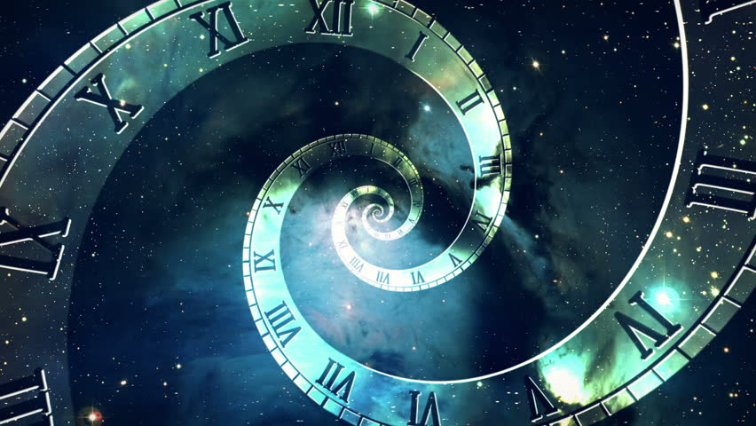
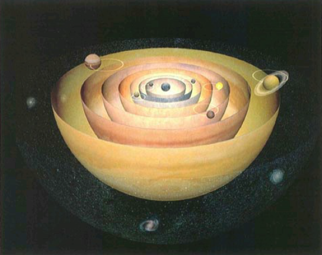

# (APPENDIX) পরিশিষ্ট {-}

*সবগুলো পরিশিষ্টই অনুবাদক যোগ করেছেন।*

# সময় কেন পেছনে চলে না? {#time}

```{r time, echo=FALSE, fig.cap = "Time", fig.align = 'center', out.width = '80%'}
knitr:: 
```

এ অংশটি আপাতত অনলাইনে সংস্করণের জন্যে উন্মুক্ত নয়। হার্ড কপি থেকে পড়ুন। 

# মহাবিশ্বের সম্ভাব্য পরিণতি {#fate}

গত শতকে আমরা জানতে পারি, মহাবিশ্বের একটি নির্দিষ্ট অতীত আছে। তার আগে স্থির অবস্থা তত্ত্ব জনপ্রিয় ছিল। ধারণা করা হত, মহাবিশ্ব অনন্তকাল ধরে উপস্থিত আছে। বয়স অনন্ত হলে ভবিষ্যৎ পরিণতি নিয়ে প্রশ্ন আসে না। কিন্তু কবির কথা, “জন্মিলে মরিতে হবে।“ তাই ভবিষ্যতে কী হবে সেটা বড় এক প্রশ্ন। 

১৯২০ সাল থেকে ১৯৫০। এই বিশ বছর ধরে বিজ্ঞানী এডউইন হাবলের পর্যবেক্ষণের মাধ্যমে পরিষ্কার বোঝা গেল, ছায়াপথরা একে অপর থেকে দূরে সরছে। এ থেকেই তৈরি হয় বিগ ব্যাং তত্ত্ব। ১৯২৭ সালে জর্জ লেমেইত্র বলেন, প্রসারণশীল মহাবিশ্ব থেকে বলা যায়, অতীতে মহাবিশ্ব ছিল নিবিড় এক বিন্দুর মতো। এর আগে আইনস্টাইনের সার্বিক আপেক্ষিক তত্ত্বের সমাধান করে আলেকজান্ডার ফ্রিডম্যানও একই কথা বলেছিলেন। আইনস্টাইনের সমীকরণের একটি সমাধান অনুসারে দেখা যায়, একটি প্রাথমিক সিংগুলারিটি থেকে জন্ম মহাবিশ্বের। ১৯৬৪ সালে আবিষ্কৃত হয় মহাজাগতিক পটভূমি বিকিরণ। বিগ ব্যাং এর পক্ষে একটি বড় প্রমাণ একটি। 

১৯৯৮ সাল থেকে শুরু করে বিভিন্ন পর্যবেক্ষণ থেকে দেখা যায়, মহাবিশ্বের প্রসারণের গতি ক্রমেই বাড়ছে। এর জন্য দায়ী শক্তিকে নাম দেওয়া হয় ডার্ক এনার্জি। আইনস্টাইনের সমীকরণ বলছিল, মহাবিশ্ব প্রসারিত হচ্ছে। কিন্তু আইনস্টাইন নিজেই সেটা বিশ্বাস করতেন না। সমীকরণ অসম্পূর্ণ মনে করে তিনি তাই বাড়তি একটি ধ্রুবক যোগ করেছিলেন। পরে স্বীকার করেন, এটা তার জীবনের সবচেয়ে বড় ভুল। কিন্তু এখন আবার মনে হচ্ছে এই ধ্রুবক দরকার আছে। এই ধ্রুবক আসলে ডার্ক এনার্জির বিপরীতে কাজ করে। 

ভবিষ্যতে মহাবিশ্বের ভাগ্যে মোটা দাগে বললে তিনটি ঘটনা ঘটতে পারে। হয় এটি চিরকাল প্রসারিত হতে থাকবে। মহাকর্ষ প্রসারণের গতি কমানোর চেষ্টা করবে। তবে ডার্ক এনার্জির কারণে প্রসারণের গতি ক্রমেই বাড়বে। আরেকটি হতে পারে, মহাবিশ্বের প্রসারণ এক সময় থেমে যাবে। শুরু হবে সঙ্কোচন। আরেকটি সম্ভাবনা হলো, প্রসারণ চলতে থাকবে। তবে প্রসারণের গতি ক্রমশ কমতে থাকবে। কিন্তু একেবারে বন্ধ হয়ে যাবে না। 

ভবিষ্যতে মহাবিশ্বের ভাগ্যে কী ঘটবে তার বড় একটি প্রভাবক হলো মহাবিশ্বের ঘনত্ব পরামিতি (density parameter)। একে গ্রিক বর্ণ ওমেগা (Ω) দিয়ে প্রকাশ করা হয়। এর মান পেতে মহাবিশ্বের বস্তুর গড় ঘনত্বকে ঘনত্বের একটি ক্রান্তি মান দ্বারা ভাগ করা হয়। ঘনত্বের যে মান খুব অল্পের জন্য মহাবিশ্বের প্রসারণকে থামাতে বন্ধ হবে তার নাম ক্রান্তি (critical) ঘনত্ব। 
মহাবিশ্বের ভবিষ্যতের সাথে এর আকৃতিরও সম্পর্ক আছে। ওমেগার মান ১-এর বেশি হলে মহাবিশ্বের আকৃতি হবে আবদ্ধ গোলকের পৃষ্ঠের মতো। কারণ এক্ষেত্রে মহাবিশ্বের ঘনত্ব ক্রান্তি ঘনত্বের চেয়ে বেশি। পৃথিবীর পৃষ্ঠের মতো এমন মহাবিশ্বের ত্রিভুজের তিন কোণের যোগফল ১৮০ ডিগ্রির বেশি হবে। তবে বড় মাপকাঠিতে মহাবিশ্বের আকৃতি হবে উপবৃত্তের মতো। মহাকর্ষের প্রভাবে এক সময় প্রসারণ থেমে যাবে। শেষ পর্যন্ত ঘটবে বিগ ক্রাঞ্চ (Big Crunch) বা মহাসঙ্কোচন। বিন্দু থেকে আসা মহাবিশ্ব বিন্দুতে গিয়েই আবার মিশে যাবে। 

```{r shape, echo=FALSE, fig.cap = "Shape of Universe", fig.align = 'center', out.width = '70%'}
knitr:: include_graphics("img/shape_of_universe.jpg")
```

তবে কিছু কিছু আধুনিক তত্ত্ব বলছে, ওমেগার মান ১-এর বেশি হলেও ডার্ক এনার্জির প্রভাবে মহাবিশ্ব প্রসারিত হতেই থাকবে। এ কারণে মহাসঙ্কোচন ঘটার সম্ভাবনা এখন পর্যন্ত অর্জিত জ্ঞান অনুসারে কম। তবে ঘটবেই না সেটা বলার জো নেই। 
ওমেগার মান ১-এর কম হলে মহাবিশ্ব হবে উন্মুক্ত। ত্রিভুজের তিন কোণের যোগফল ১৮০ ডিগ্রির কম হবে। মহাকর্ষ প্রসারণকে কিছুটা কমাবে। কিন্তু ডার্ক এনার্জির প্রভাবে সে বাধা উপেক্ষা করে প্রসারণের গতি বরং আরও বেড়ে যেতে থাকবে। এভাবে চলতে থাকলে একসময় মহাকর্ষ, তড়িচ্চুমকত্ব ও সবল নিউক্লীয় বলের বাঁধন ছিঁড়ে যাবে। এ অবস্থাকে বলা হয় বিগ রিপ (Big Rip) বা মহাভাঙন। 

একই রকম পরিস্থিতিতে আরেকটি সম্ভাব্য পরিণতির নাম বিগ ফ্রিজ (Big Freeze) বা মহাহিমায়ন। এ অবস্থায় সর্বত্র বিরাজ করবে হিমশীতল অবস্থা। হবে না কোনোরকম তাপ বিনিময়। থেমে যাব বস্তুকণার চলাচল। এ কারণে এর অপর নাম তাপীর মৃত্যু। এটা ঘটে গেলে বস্তুর মধ্যে আর কোনো প্রকার তাপ বিনিময় সম্ভব হবে না। সব যন্ত্র অচল হয়ে যাবে। এনট্রপি (শক্তি রূপান্তরের অক্ষমতা) হবে সর্বোচ্চ। 

তবে মহাবিশ্বের ঘনত্ব ক্রান্তি ঘনত্বের সমানও হয়ে যেতে পারে। সত্যি বলতে, বর্তমান পর্যবেক্ষণ এর পক্ষেই কথা বলছে। এমন মহাবিশ্বেই ত্রিভুজের তিন কোণের যোগফল ১৮০ ডিগ্রি হয়। এক্ষেত্রে মহাবিশ্ব হবে সমতল। পর্যবেক্ষণ বলছে, মহাবিশ্ব এমনই। এই ফলাফলের ত্রুটির মাত্রা মাত্র ০.৪%। এই মহাবিশ্বও চিরকাল প্রসারিত হবে, তবে প্রসারণের হার ক্রমশ কমবে। তবে কখনোই একেবারে থেমে যাবে না। তবে ডার্ক এনার্জি ভূমিকা রাখলে প্রসারণ শুরুতে থামলেও আবার বেড়ে যাবে। পরিণতি হবে সেই উন্মুক্ত মহাবিশ্বের মতোই। 

আরও কিছু কমসম্ভাব্য ঘটনা ঘটতে পারে মহজাবিশ্বের ভাগ্যে। এর একটি হলো বিগ বাউন্স। এটা আসলে মহাবিশ্ব সম্পর্কে চক্রাকার মডেলের একটি অংশ। এটি অনুসারে, মহাবিশ্ব শুরু হয়েছিল সঙ্কুচিত অবস্থা থেকে। আর সেই সঙ্কুচিত অবস্থাটা এসেছিল তার পূর্ববর্তী একটি প্রসারণ থেমে গিয়ে গুটিয়ে যাওয়ার মাধ্যমে। এভাবেই মহাবিশ্ব একের পর সঙ্কুচিত ও প্রসারিত হচ্ছে। একের পর ঘটছে বিগ ব্যাং ও বিগ ক্রাঞ্চ। এ জন্যেই এই মডেলের নাম চক্রাকার মডেল। 

বিজ্ঞানীরা বলছেন আরও একটি সম্ভাবনার কথা। এর নাম বিগ স্লার্প (Big Slurp)। স্লার্প অর্থ গ্রাস করা বা গ্রাস করার সময় সৃষ্ট শব্দ। এ তত্ত্ব অনুসারে মহাবিশ্ব এখন নকল ভ্যাকুয়াম অবস্থায় আছে। যেকোনো সময় চলে যেতে পারে প্রকৃত ভ্যাকুয়ামে। প্রকৃতির যেকোনো ভৌত প্রক্রিয়া সবসময় সর্বিনিম্নের শক্তির অবস্থানে থাকতে চায়। আর মহাবিশ্ব সর্বনিম্ন শক্তির অবস্থায় থাকলেই কেবল প্রকৃত ভ্যাকুয়ামে থাকবে। এখন সেটা নাও হতে পারে। হয়ত মহাবিশ্ব এখন উচ্চতর শক্তির অবস্থানে আছে। তার মানে আছে নকল ভ্যাকুয়াম অবস্থায়। সেক্ষেত্রে যেকোনো সময় এটি আসল ভ্যাকুয়ামে চলে যাবে। তার সাথে সাথে আমূল পাল্টে যাবে আমাদের চিরচেনা মহাবিশ্ব। ভৌত ধ্রুবকদের মান বদলে যেতে পারে। পাল্টে যেতে পারে আলোর বেগের মান কিংবা অ্যাভোগেড্রো ধ্রুবক। ফলে স্থান, কাল, বস্তু ও শক্তির ধারণা একদম বদলে যেতে পারে। হয়ত আগাম কোনো সঙ্কেত না দিয়েই ধ্বংস হয়ে যাবে মহাবিশ্ব। 
বিষয়টি নিয়ে বিস্তারিত আলোচনা করা হয়েছে এগারশ ও তৃতীয় অধ্যায়ে। 

# বিজ্ঞান কীভাবে কাজ করে? {#science}

বিজ্ঞান কী, কীভাবে কাজ করে সেটা নিয়ে আমাদের সমাজের খুব কম মানুষেরই ধারণা আছে বলে মনে হয়। বিজ্ঞানের কিছু কিছু বিষয় নিয়ে বিতর্কের কারণও সম্ভবত এটাই। বিজ্ঞান কী ও কীভাবে কাজ করে এ বিষয়ে অ্যা ব্রিফার হিস্ট্রি অব টাইম বইয়ের তৃতীয় অধ্যায়ে স্টিফেন হকিং যথেষ্ট আলোচনা করেছেন। এই বইয়ের অনুবাদক অনুবাদ করেছেন সে বইটিও। এখানে তার আলোকেই সংক্ষেপে বলছি। 

বিজ্ঞান মূলত অনেকগুলো বৈজ্ঞানিক তত্ত্বের সমাবেশ। আর বৈজ্ঞানিক তত্ত্ব হলো একটি মডেল, যা পর্যবেক্ষণে পাওয়া ঘটনাকে ব্যাখ্যা করতে পারবে এবং ভবিষ্যতে কী ঘটতে পারে সেটা সম্পর্কে সুনির্দিষ্ট অনুমান বা পূর্বাভাস দিতে পারবে। বৈজ্ঞানিক তত্ত্বকে কখনোই সঠিক বলা যায় না। তত্ত্বের পূর্বাভাস পরিবর্তী পর্যবেক্ষণের সাথে হাজারবার মিলেও গেলেও আপনি বলতে পারবেন না তত্ত্বটা সঠিক বা নিঁখুত। হতে পারে, পরেরবারই পূর্বাভাস ভুল হয়ে যাবে। 

পরিসংখ্যানবিদ জর্জ বক্সের কথাটি তাই যথার্থ। 

> সব মডেলই ভুল, তবে কিছু মডেল কার্যকর।

পরিসংখ্যানের ছাত্র ও শিক্ষক হওয়ার সুবাদে বৈজ্ঞানিক পদ্ধতির সাথে সম্পর্কটা আরেকটু গভীর আমার। পরিসংখ্যানে আমরা ডেটা বা উপাত্ত নিয়ে কাজ করি। তারপর সেটা থেকে সবচেয়ে ভাল ভাল মডেল দিয়ে প্রেডিকশন বা পূর্বানুমান করি। যে মডেল সবচেয়ে ভালোভাবে পূর্বানুমান দিতে পার, সেটা নিয়ে আরও কাজ করি। জর্জ বক্সের কথা অনুসারেই, কোনো মডেলই বাস্তব জগতকে সঠিকভাবে ব্যাখ্যা করতে পারে না। কিন্তু যতটুকু পারে সেটা বাস্তব কাজকর্মের জন্যে যথেষ্ট। কার্যকর। 

বৈজ্ঞানিক তত্ত্বগুলোও পর্যবেক্ষণে পাওয়া তথ্য-উপাত্ত নিয়ে এভাবেই কাজ করে। উদাহরণ হিসেবে বলা যায়, নিউটনের মহাকর্ষীয় তত্ত্বের কথা। অনেক সুন্দর তত্ত্ব। কিন্তু আমরা জানি, এটা আসলে একটি ত্রুটিপূর্ণ তত্ত্ব। বুধ গ্রহের কক্ষপথের সঠিক ব্যাখ্যা তত্ত্বটি দিতে পারেনি। যেটা পেরেছে আইনস্টাইনের সার্বিক আপেক্ষিক তত্ত্ব। কিন্তু আমরা আরও জানি, নিউটনের তত্ত্ব ভুল হলেও কার্যকর। এই তত্ত্ব দিয়েই মহাকাশে যান পাঠানো হয়। যদিও বড় ভরের বস্তুর ক্ষেত্রে তত্ত্বটি ভুল ফল দেয়। নিউটনের গতিবিদ্যাও সব রকম গতিকে ব্যাখ্যা করতে পারে না। ব্যর্থ অতিপারমাণবিক জগতের কণার গতির ব্যখ্যা দিতে। বা আলোর বেগের কাছাকাছি বেগে চলার বস্তুর গতির সঠিক বিবরণ দিতে। চিরায়ত গতিবিদ্যা কৃষ্ণবস্তুর বিকিরণ ব্যাখ্যা করতে পারে না। পারে না আলোকতড়িৎ ক্রিয়া কিংবা হাইড্রোজেনের মতো সরল পরমাণুর ব্যাখ্যা দিতে। 

নিউটনের তত্ত্বের বদলে আসা আইনস্টাইনের সার্বিক আপেক্ষ তত্ত্বও কি নিখুঁত? বিজ্ঞানীরা এখনই জানেন, তত্ত্বটায় ভুল আছে। যদিও ২০১৫ সালের মহাকর্ষ তরঙ্গ আবিষ্কারের মাধ্যমে তত্ত্বটি নিজের শক্তির জানান দিয়েছে। কিন্তু ঐ যে একই কথা। তত্ত্বটা কার্যকর। কিন্তু সঠিক দাবি করা যাবে না। 

আকাশে গ্রহদের এলোমেলো চলাচল দেখে প্রাচীন গ্রিক জ্যোতির্বিদ টলেমি বলেছিলেন, পৃথিবী মহাবিশ্বের কেন্দ্র। সবাই পৃথিবীকে কেন্দ্র করে ঘুরছে। ঘুরছে গ্রহরাও পৃথিবীর চারদিকে নিজ নিজ কক্ষপথে। তবে গ্রহরা আবার নিজের কক্ষপথের মধ্যেই আরেকটি ছোট বৃত্তাকার কক্ষপথেও ঘুরছে। এর মাধ্যমে গ্রহদের এলোমেলো চলাচলের দারুণ ব্যাখ্যা পাওয়া গেল। তত্ত্বটি দারুণ প্রশংসা কুড়াল। কিন্তু তত্ত্বটি অনুসারে চাঁদ ও পৃথিবীর দূরত্ব মাঝেমাঝে অর্ধেক সাধারণ দূরত্বের অর্ধেক হয়ে যাওয়ার কথা। যা ভুল। এভাবে ভাল এই তত্ত্বও ভুল প্রমাণিত হয়। 

```{r ptolemy, echo=FALSE, fig.cap = "Ptolemy's model", fig.align = 'center', out.width = '70%'}
knitr:: 
```
 
চিত্র: টলেমির মডেল। টলেমির মডেলে পৃথিবীর অবস্থান ছিল মহাবিশ্বের কেন্দ্রে, এবং একে ঘিরে রাখা আটটি গোলক মহাকাশের সবগুলো বস্তুকে ধারণ করে রেখেছিল।

এক কথায়, কোনো তত্ত্বই সঠিক নয়। নিছক কার্যকর। কাজে লাগিয়ে দারুণ কিছু কাজ করা যায় এই যা। 

তাই বিজ্ঞান বা কোনো বৈজ্ঞানিক তত্ত্ব সম্পর্কে বলা যায় না, আমি একে সত্য বলে মানছি। আবার এটাও বলা যায় না যে একে আমি পরিত্যাগ করব। বরং যতদিন কাজে লাগে ব্যবহার করব। তাই ধর্ম ও কোনো বৈজ্ঞানিক তত্ত্বের একটাকে আরেকটার বিপক্ষে ব্যবহার করার চর্চা থেকে বেরিয়ে আসা দরকার। আরও দরকার সহনশীলতার চর্চা। জিনিসটার অনেক অভাব বর্তমান সময়ে। 

# পরিভাষা {#terms}

শীঘ্রই যুক্ত করা হবে। 

# ফিডব্যাক {#feedback}

## যোগাযোগ 

লেখকের সাথে যোগাযোগ করতে চাইলে ইমেইল করুন: almahmud.sbi@gmail.com

## ত্রুটি 

বইটিতে কোনো ভুল চোখ পড়লে দয়া করে ইমেইলের মাধ্যমে লেখককে জানান। যথাশীঘ্র সংশোধন করে নেওয়া হবে। 

- [x] [এখানে](https://github.com/mahmudstat/l3m/issues/new) ক্লিক করেও ভুল সম্পর্কে রিপোর্ট করতে পারেন। 